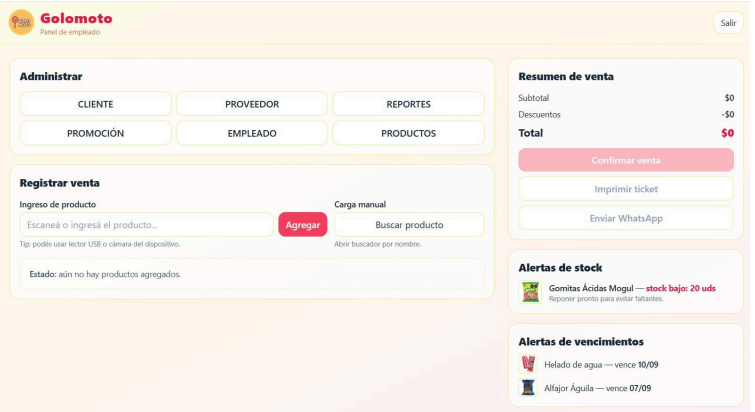
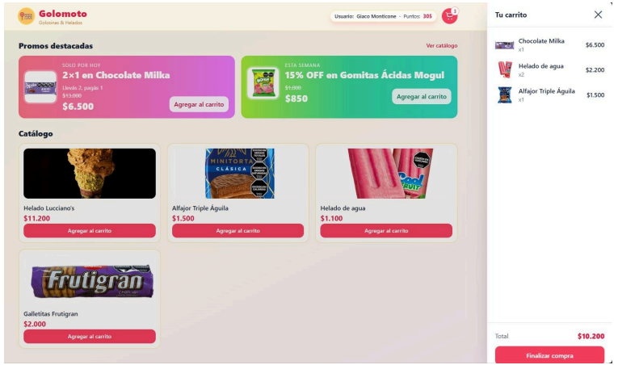

# 🍬 Golomoto — Sistema de Gestión Contable y Control de Stock

Proyecto de análisis y diseño de software desarrollado para **Golomoto**, un emprendimiento de venta de golosinas, chocolates y helados (presencial y delivery) en Bahía Blanca, Argentina.

Trabajo final de **Análisis de Sistemas I (2023) y Análisis de Sistemas II (2025)** — Tecnicatura Superior en Computación, Universidad Nacional del Sur (UNS).

> 👥 Autores: Agustina Corei · Giaco Monticone

---

## 🧩 El problema

El sistema existente combinaba registro manual en papel y un software contable genérico (GnuCash) que no se adaptaba al negocio. Esto generaba información imprecisa, falta de control de stock en tiempo real, imposibilidad de gestionar promociones y vencimientos, y baja escalabilidad.

---

## 🎯 Solución propuesta

Sistema integral que unifica compras, ventas, stock, clientes y reportes — con dos interfaces diferenciadas: panel de empleados y app web para clientes con sistema de puntos y pedidos online.

---

## 📋 Contenido del repositorio

| Archivo | Descripción |
|---------|-------------|
| `Examen final - Analisis II - Monticone y Corei.pdf` | Análisis completo del sistema — Cursada 2023 |
| `Sistema para_Golomoto_-Moticone, Corei.pdf` | Diseño completo del sistema — Cursada 2025 |

---

## 📐 Qué cubre el análisis (I y II)

**Análisis de Sistemas I — 2023**
- Entrevista con el cliente real (audio disponible)
- Relevamiento de requerimientos funcionales y no funcionales
- Análisis del sistema existente (puntos fuertes y débiles)
- Diagrama de clases
- Diagrama de casos de uso con escenarios
- Diagrama de secuencia
- Modelo Entidad-Relación

**Análisis de Sistemas II — 2025**
- Extensión del sistema: pedidos online, sistema de puntos, alertas de stock y vencimientos
- Diagrama de contexto
- Modelo de casos de uso ampliado (empleado y cliente)
- Diagramas de secuencia de sistema y de diseño
- Diagrama de clases de objetos con métodos
- Diagrama de estados (producto y promoción)
- Arquitectura en 5 capas: Presentación · API (.NET) · Servicio · Acceso a datos · MySQL
- Modelo ER completo + pasaje a tablas + normalización
- Diseño de interfaces (mockups para empleados y clientes)
- Estimación de costos y cronograma de desarrollo por fases

---

## 🛠️ Stack propuesto en el diseño

| Capa | Tecnología |
|------|-----------|
| Frontend | HTML · Tailwind CSS · JavaScript |
| API | .NET |
| Lógica de negocio | C# |
| Base de datos | MySQL |

---

## 📸 Mockups del sistema

### Panel de empleados

### Tienda web para clientes

---

## 👩‍💻 Autoras

**Agustina Corei**
[github.com/coreiagu](https://github.com/coreiagu) · [linkedin.com/in/agustinacorei](https://linkedin.com/in/agustinacorei)

**Giaco Monticone**
[github.com/monticonegiaco](https://github.com/monticonegiaco)

---

*Proyecto académico — Tecnicatura Superior en Computación (UNS) · 2023–2025*
